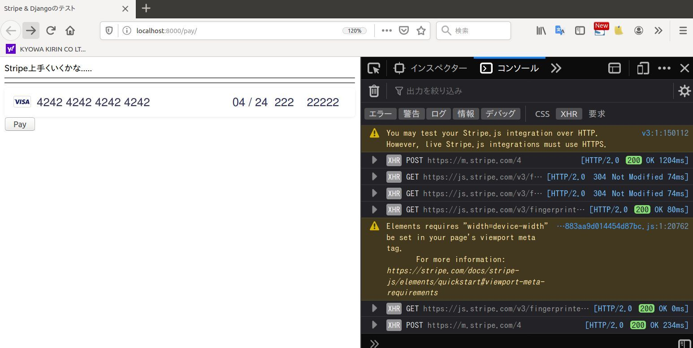

+ Django 3
+ Stripe

```
create virtual env

pip install django
pip install stripe

git clone this repository....

cd djnago-stripe
python manage.py runserver
http://localhost:8000/pay

input card number (demo)  424242424242424242424242...

```
